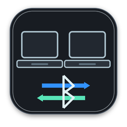

<p align="center">
  
</p>

# MagicSwitch

MagicSwitch is a tiny macOS menu bar app for switching an Apple Magic Keyboard, Magic Trackpad, or similar Bluetooth devices between Macs.

It coordinates Macs over the local network: one Mac releases the configured Bluetooth devices, then the selected target Mac pairs/connects to them. It is meant for people who keep multiple Macs on the same desk and want fewer USB cables, hubs, and manual Bluetooth forget/re-pair cycles.

This is an early release. It works well for the setup it was built against, but Apple Bluetooth behavior can vary across macOS versions and devices.

## Requirements

- At least two Macs on the same local network.
- macOS 13 Ventura or newer.
- Bluetooth and Local Network permissions granted when macOS asks.
- Your Magic devices paired at least once.
- For building from source: Xcode Command Line Tools.

## Install

1. Download `MagicSwitch-v0.1.9.dmg` from the release.
2. Open the disk image.
3. Drag `MagicSwitch.app` onto the `Applications` shortcut.
4. Launch `MagicSwitch.app` from `Applications` on both Macs.
5. Approve Bluetooth and Local Network permissions when prompted.
6. Open the MagicSwitch menu bar icon and choose `Manage Devices...` on each Mac.
7. Choose the target Mac if more than one peer is discovered.
8. Click `Scan`, then add the keyboard, trackpad, mouse, or other Bluetooth peripherals you want MagicSwitch to move.
9. If a fresh Mac does not list the peripherals yet, choose the target Mac and click `Import Peripherals`.

MagicSwitch is ad-hoc signed in the public disk image. On first launch, macOS may ask you to confirm that you want to open it.

## macOS Permissions

MagicSwitch needs:

- `Bluetooth`: to pair, release, and connect configured peripherals.
- `Local Network`: to discover and communicate with other Macs running MagicSwitch.

You can review these in `System Settings > Privacy & Security > Bluetooth` and `System Settings > Privacy & Security > Local Network`.

MagicSwitch does not need Remote Login, SSH, Screen Sharing, Accessibility, or Full Disk Access. Remote Login was only useful while developing and installing test builds across two Macs.

## Troubleshooting

### Devices Appear Connected But Do Not Work After Sleep

If your keyboard, trackpad, or mouse appears in the macOS Bluetooth list but does not actually move or type, the device may be stuck in a stale paired state after sleep.

Try this first:

1. Open the MagicSwitch menu bar icon on the Mac you want to use.
2. Choose `Repair Devices on This Mac`.
3. Wait for the operation to finish before clicking another switch action.

The repair action refreshes the local connection without forgetting the pairing. If macOS still cannot reach the physical device, power-cycle the keyboard, trackpad, or mouse once, then accept the macOS Bluetooth connection prompt.

Avoid repeatedly clicking switch actions while a repair or switch is running. Slow Bluetooth recovery can take more than a minute when a device has been asleep.

### Peer Is Not Reachable

If switching says the peer is not reachable, or the log mentions `Network is down` or `No route to host`, macOS is usually blocking MagicSwitch from Local Network access.

On both Macs:

1. Open `System Settings > Privacy & Security > Local Network`.
2. Enable `MagicSwitch`.
3. Quit and reopen `MagicSwitch`.

If you installed a new ad-hoc build, macOS may ask for Local Network or Bluetooth permission again. Allow both on each Mac before testing switching.

### `"MagicSwitch" Not Opened`

If macOS says it could not verify that MagicSwitch is free of malware, Gatekeeper is blocking the app because the current public build is ad-hoc signed but not notarized yet. Only continue if you downloaded MagicSwitch from the official GitHub release.

You can usually open it from Finder:

1. Open Finder.
2. Go to `Applications`.
3. Control-click or right-click `MagicSwitch.app`.
4. Choose `Open`.
5. In the warning dialog, choose `Open` again.

If macOS still blocks it:

1. Try opening `MagicSwitch.app` once, so macOS records the block.
2. Open `System Settings`.
3. Go to `Privacy & Security`.
4. Scroll down to `Security`.
5. Find the message that says `MagicSwitch` was blocked.
6. Click `Open Anyway`.
7. Confirm with `Open Anyway` or `Open`.

Apple documents this override flow here: [Open a Mac app from an unknown developer](https://support.apple.com/guide/mac-help/open-a-mac-app-from-an-unknown-developer-mh40616/mac).

## Configure Devices

Most users should configure devices from the menu bar icon under `Manage Devices...`.

The `Target Mac` section lists other Macs running MagicSwitch on the same local network. MagicSwitch advertises itself with Bonjour and detects other instances automatically. You do not add MacBooks as devices. If only one peer is discovered, `Auto` is fine. If several Macs are discovered, choose the Mac this one should switch with.

The peripherals sections are only for Bluetooth devices. Use `Add` and `Remove` to choose what MagicSwitch switches. If the keyboard or trackpad is currently only known to the other Mac, choose that Mac as the target and click `Import Peripherals`; MagicSwitch copies the configured peripheral names and Bluetooth addresses from the target Mac.

MagicSwitch reads:

```text
~/Library/Application Support/MagicSwitch/config.json
```

On first launch, MagicSwitch creates a placeholder config at that path. Replace the placeholder addresses with your devices:

```json
{
  "targetPeerName": null,
  "devices": [
    {
      "name": "Magic Keyboard",
      "address": "AA:BB:CC:DD:EE:FF"
    },
    {
      "name": "Magic Trackpad",
      "address": "11:22:33:44:55:66"
    }
  ]
}
```

You can also point to another config file:

```zsh
MAGICSWITCH_CONFIG=/path/to/config.json open /Applications/MagicSwitch.app
```

### Find Bluetooth Addresses

If you have `blueutil`:

```zsh
blueutil --paired
```

Or use macOS built-ins:

```zsh
system_profiler SPBluetoothDataType
```

Look for the device address for your keyboard, trackpad, or mouse and paste it into `config.json`.

## Use

Run MagicSwitch on both Macs. In the menu bar, click the MagicSwitch icon:

- `Switch Devices`: moves the configured devices to the other Mac when they are currently connected locally, or takes them to this Mac otherwise.
- `Take Devices to This Mac`: asks the peer Mac to release the devices, then connects them here.
- `Disconnect Devices from This Mac`: closes the local Bluetooth connections without forgetting pairings.
- `Repair Devices on This Mac`: refreshes local connections when devices appear connected after sleep but do not work.
- `Forget Pairings on This Mac...`: explicitly removes the local Bluetooth pairings after confirmation.
- `Manage Devices...`: choose the target Mac, import peer peripherals, and add or remove Bluetooth peripherals from the switch list.
- `Open Config`: opens the active config file.
- `Open Log`: opens the app log.

Logs are written to:

```text
~/Library/Logs/MagicSwitch/MagicSwitch.log
```

## Build

```zsh
scripts/build-app.sh
```

The app bundle is written to:

```text
build/MagicSwitch.app
```

To create release artifacts:

```zsh
scripts/package-release.sh 0.1.9
```

The artifacts are written to:

```text
dist/MagicSwitch-v0.1.9.dmg
dist/MagicSwitch-v0.1.9.zip
```

## How It Works

MagicSwitch runs a small TCP listener on each Mac on port `58423` and advertises it with Bonjour as `_magicswitch._tcp`. Other MagicSwitch instances on the same local network discover that service automatically. When switching, the active Mac first checks that the selected peer is reachable, then tells it to release or take the configured Bluetooth devices.

For each configured Bluetooth device, MagicSwitch uses macOS `IOBluetooth` APIs to:

- close the active connection,
- remove pairings on the source Mac during a real switch while the devices are still connected,
- keep target-side pairings intact during failed take attempts,
- try to restore devices to the source Mac if the target Mac cannot take them,
- remove local pairings from the explicit forget action,
- start pairing on the target Mac,
- open a Bluetooth connection on the target Mac.

## Limitations

- MagicSwitch works best for desk setups where the Macs are awake on the same local network.
- Multi-Mac setups are supported by choosing a `Target Mac` in `Manage Devices...`.
- If a device is not discoverable, you may need to power-cycle it or pair it once manually.
- The public build is not notarized yet.
- This project is not affiliated with Apple.
